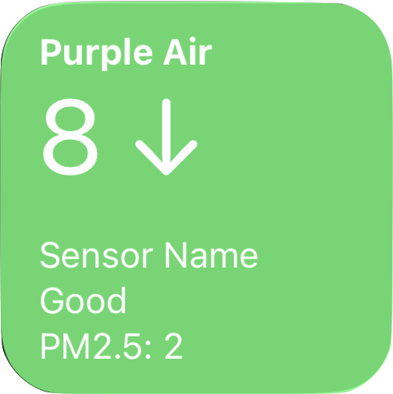
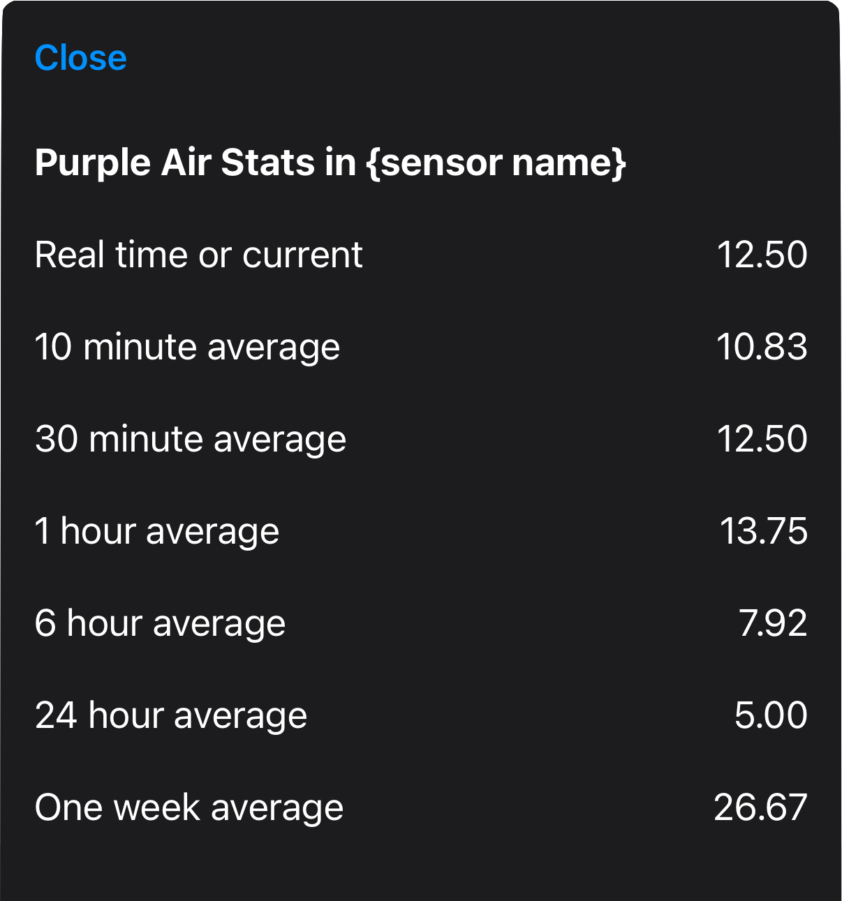

# Purple-Air-Scriptable
An automated iOS script for real time air quality monitoring using Purple Air APIs

## Preview

**Widget mode** — AQI and trend on the home screen:



**Non-widget mode** — Run from the Scriptable app to see a table of PM2.5 averages by time range:



---

## Getting started

### 1. Download the Scriptable app

1. On your **iPhone** or **iPad**, open the **App Store**.
2. Search for **Scriptable** (by Simon B. Støvring) or open this link: [Scriptable on the App Store](https://apps.apple.com/us/app/scriptable/id1405459188).
3. Tap **Get** (or **Download**) and install the app.

Scriptable lets you run JavaScript on iOS and use scripts as home screen widgets.

### 2. Create the script

1. Open the **Scriptable** app.
2. Tap the **+** (plus) button in the top-right to create a new script.
3. Give the script a name (e.g. **Purple Air**).
4. Copy the contents of **`purpleair.js`** from this repo and paste them into the script editor (replace any default code).
5. Tap the **play** button or **Run** to test the script. When run from the app (not as a widget), it shows a table of air quality stats. For the script to work, you must set the widget parameter (see step 3 below) before using it in a widget.

### 3. Add a widget that runs the script

1. From your **Home Screen**, long-press an empty area (or a widget) until the icons start to jiggle.
2. Tap the **+** in the top-left (or **Add Widget**).
3. Search for **Scriptable** and tap it. Choose a widget size (e.g. **Small** or **Medium**) and tap **Add Widget**.
4. The new widget will show “Scriptable” as a placeholder. **Long-press the widget** and tap **Edit Widget** (or tap the widget and pick **Edit**).
5. Under **Script**, select the script you created (e.g. **Purple Air**).
6. In **Parameter**, enter your sensor index and API key in the form:  
   `SENSOR_INDEX:API_READ_KEY`  
   Example: `123456:your-read-key-here`  
   (You need an API key from [develop.purpleair.com](https://develop.purpleair.com/keys); see below.)
7. Tap outside the widget or press the Home button to save. The widget will refresh and show air quality for your sensor.

To change the sensor or API key later, long-press the widget → **Edit Widget** and update **Parameter**.

---

## API authentication (develop.purpleair.com)

To call the Purple Air API (for example, the sensor endpoint), you need to authenticate with an API key created in the Purple Air developer portal.

### 1. Create an API key

1. Go to **[develop.purpleair.com](https://develop.purpleair.com/)** and sign in or create an account.
2. Open the **[API Keys](https://develop.purpleair.com/keys)** page.
3. Create a new **Read** key. Copy and store it securely; it is shown only once.

### 2. Authenticate requests

Use your **Read** key when calling the API. Send it in the **`X-API-Key`** header.

**Endpoint example:**  
`GET https://api.purpleair.com/v1/sensors/{sensor_index}`

Replace `{sensor_index}` with the numeric sensor index (e.g. `123456`).

**Example request (curl):**

```bash
curl -H "X-API-Key: YOUR_READ_KEY" \
  "https://api.purpleair.com/v1/sensors/123456"
```

**Example in JavaScript (e.g. Scriptable):**

```javascript
let sensorIndex = 123456  // your sensor index
let req = new Request(`https://api.purpleair.com/v1/sensors/${sensorIndex}`)
req.headers = { "X-API-Key": "YOUR_READ_KEY" }
let json = await req.loadJSON()
```

Use your actual Read key in place of `YOUR_READ_KEY`. Do not commit API keys to version control; use environment variables or app settings instead.

For private sensors, you may also need to pass the sensor’s **read_key** (e.g. as a query parameter), as described in the [Purple Air API docs](https://api.purpleair.com/).

### 3. Widget parameter (Scriptable)

In the Scriptable widget, set the **Parameter** to:

- **Sensor + API key:** `SENSOR_INDEX:API_READ_KEY` (e.g. `123456:your-read-key-here`) — uses the authenticated v1 API `GET https://api.purpleair.com/v1/sensors/{sensor_index}` with the `X-API-Key` header set to your key.

Use the colon format when you have a Read key from [develop.purpleair.com](https://develop.purpleair.com/keys); the script will send it in the request header and use the v1 sensor endpoint.
